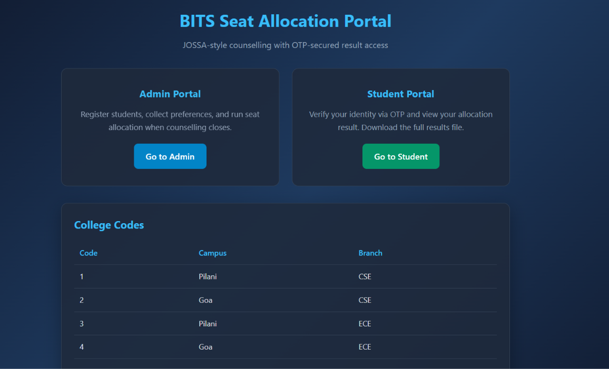
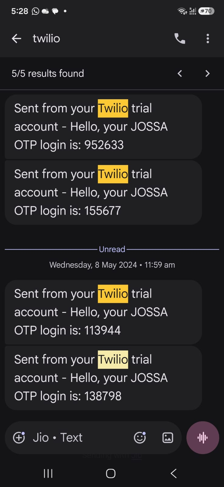
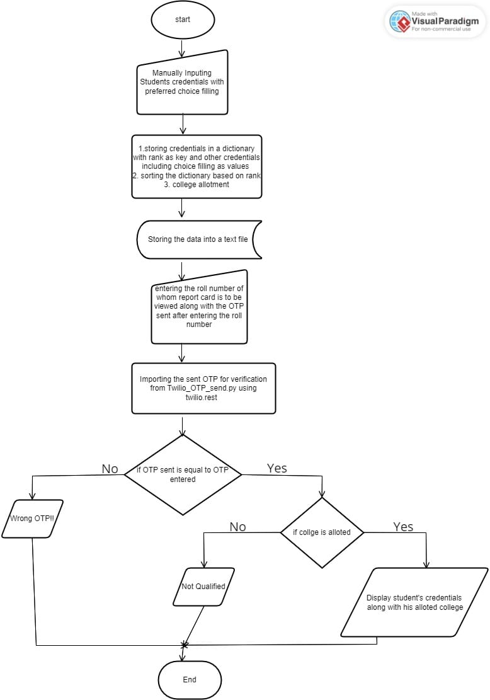

<div align="center">

# JOSSA-Style Seat Allocation Portal

A Flask-based web application that simulates the JOSAA counselling process by allocating seats based on student rank, preferences, and seat availability. The portal includes secure OTP-based authentication using Twilio, an admin dashboard, and downloadable allocation reports.

### Live Demo

https://bits-jossa-college-allocation-syste.vercel.app/

<br>


</div>

---

# Overview

This project recreates a simplified version of the JOSAA seat allocation workflow through an interactive web portal.

Students register their counselling preferences, administrators execute the allocation engine, and students securely access their allocated seat after OTP verification via Twilio SMS.

Originally implemented as a command-line application, the project was redesigned into a Flask web application with a cleaner architecture, REST APIs, and a responsive user interface.

---

# Key Features

### Admin Dashboard

- Register students
- Store rank and preference order
- Execute seat allocation
- Download allocation results

### Student Portal

- Login using Rank
- OTP verification through Twilio
- Secure access to allocated seat

### Seat Allocation Engine

- Preference-based allocation
- Seat availability validation
- Randomized sorting algorithm implementation

### Export Results

- Download final allocation report
- Generates `students_placement.txt`

---

# Tech Stack

| Category | Technologies |
|-----------|--------------|
| Backend | Python, Flask |
| Frontend | HTML, CSS, JavaScript |
| Authentication | Twilio SMS OTP |
| Deployment | Vercel |
| Data Storage | File-based |
| Algorithms | Bubble, Selection, Insertion, Merge & Quick Sort |

---

# Screenshots

## Portal Interface

<p align="center">

</p>

---

## OTP Authentication

<p align="center">

</p>

---

## Seat Allocation Workflow

<p align="center">

</p>

---

# How It Works

```text
                Admin Portal
                     │
                     ▼
           Register Students
                     │
                     ▼
        Store Preferences & Rank
                     │
                     ▼
       Execute Seat Allocation
                     │
                     ▼
        Generate Allocation File
                     │
      ┌──────────────┴──────────────┐
      ▼                             ▼
 Student Portal                Download Results
      │
      ▼
 Enter Rank
      │
      ▼
 Send OTP via Twilio
      │
      ▼
 Verify OTP
      │
      ▼
 View Allocation Result
```

---

# College Codes

| Code | Campus | Branch |
|------:|---------|---------|
| 1 | Pilani | CSE |
| 2 | Goa | CSE |
| 3 | Pilani | ECE |
| 4 | Goa | ECE |

**Seat Capacity**

- Total Seats : **8**
- 2 seats per Campus-Branch combination

---

# Project Structure

```text
.
├── app.py
├── allocation.py
├── sorting.py
├── twilio_otp.py
├── templates
│   ├── index.html
│   ├── admin.html
│   └── student.html
│
├── static
│   ├── UI.png
│   ├── OTP_screenshot.jpg
│   ├── Flow_chart.jpg
│   └── style.css
│
├── requirements.txt
├── .env.example
├── README.md
└── students_placement.txt
```

---

# API Endpoints

| Method | Endpoint | Description |
|---------|----------|-------------|
| GET | `/` | Home Page |
| GET | `/admin` | Admin Dashboard |
| GET | `/student` | Student Portal |
| GET | `/api/students` | Retrieve Students |
| POST | `/api/students` | Register Student |
| POST | `/api/run-allocation` | Execute Allocation |
| POST | `/api/send-otp` | Send OTP |
| POST | `/api/verify-otp` | Verify OTP |
| GET | `/api/download-results` | Download Allocation Report |
| GET | `/api/status` | Application Status |

---

# Local Setup

## Clone Repository

```bash
git clone <repository-url>
cd "BITS Allocation Python"
```

---

## Create Virtual Environment

```bash
python -m venv venv
```

### Windows

```bash
venv\Scripts\activate
```

### Linux / macOS

```bash
source venv/bin/activate
```

---

## Install Dependencies

```bash
pip install -r requirements.txt
```

---

## Configure Environment Variables

Create a `.env` file.

```env
TWILIO_ACCOUNT_SID=xxxxxxxxxxxxxxxxxxxxxxxx
TWILIO_AUTH_TOKEN=xxxxxxxxxxxxxxxxxxxxxxxx
TWILIO_PHONE_NUMBER=+1xxxxxxxxxx
FLASK_SECRET_KEY=your_secret_key
```

---

## Run

```bash
python app.py
```

Application will start on

```
http://localhost:5000
```

---

# Future Improvements

- MySQL/PostgreSQL integration
- Multi-round counselling support
- Admin authentication
- Editable student preferences
- CSV import/export
- Analytics dashboard
- Email notifications
- Docker deployment
- Unit testing
- CI/CD pipeline using GitHub Actions

---

# License

Licensed under the **MIT License**.

---

<div align="center">

Made with **Flask**, **Python**, and **Twilio**

</div>